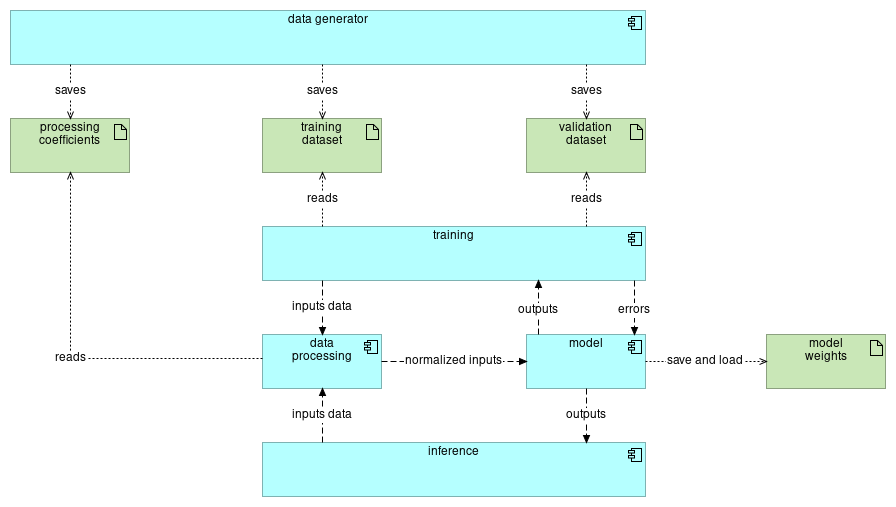
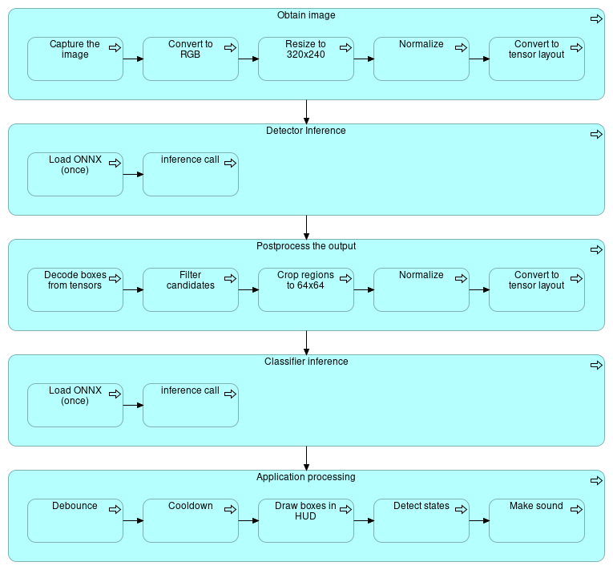
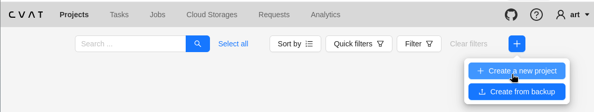
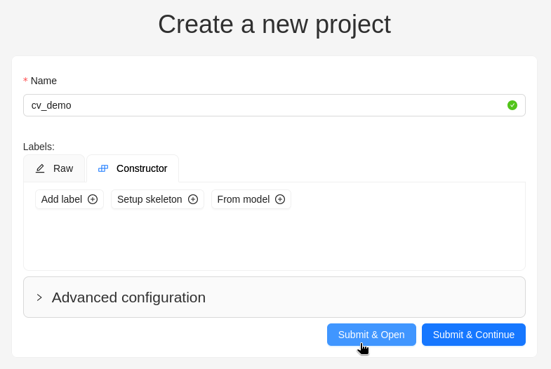
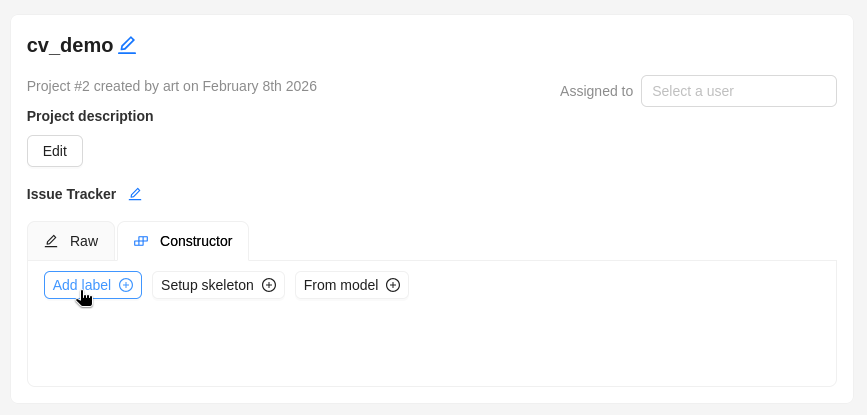
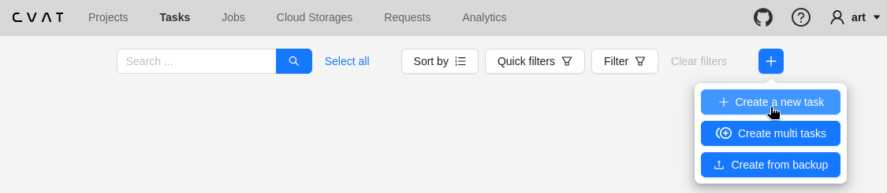

# DISCLAIMER

THIS PROJECT USES INTENTIONALLY SIMPLE AND EXPLICIT CODE.

IT IS NOT A SHOWCASE OF CODING STYLE OR ENTERPRISE PRACTICES, BUT A DEMONSTRATION OF THE AMOUNT OF WORK AND THE CORE CONCEPTS THAT ARE ACTUALLY NECESSARY. TO COOK A GOOD MEAL YOU DO NOT NEED TO CUT POTATOES INTO PERFECT SPHERES. YOU NEED TO PEEL THEM, ADD ENOUGH SALT, AND BOIL THEM UNTIL WELL DONE.

# pytorch-tutorial

An artificial neural network is a mathematical construct designed to approximate complex relationships between inputs and outputs. Its conceptual inspiration comes from biological nervous systems, but its practical formulation is purely mathematical. Rather than being programmed with explicit rules, a neural network learns its behavior from data by adjusting internal parameters so that its predictions increasingly resemble the desired outcomes.

At the core of every neural network lies the artificial neuron. An artificial neuron receives a collection of input values, multiplies each by a corresponding weight, adds a bias term, and then applies a nonlinear activation function to the result. The weights and bias form the trainable parameters of the model. The activation function is not a cosmetic detail: without it, the entire network would reduce to a single linear transformation, regardless of how many layers it contains. Nonlinearity is what allows neural networks to represent anything beyond trivial linear relationships.

Neural networks are built by arranging neurons into layers. The input layer receives raw numerical features derived from data. One or more hidden layers perform successive transformations, each layer operating on the outputs of the previous one. The final layer produces the network’s prediction. This layered organization enables the network to construct representations of increasing abstraction, where early layers tend to respond to simple patterns and later layers combine those patterns into more complex structures relevant to the task at hand.

The practical strength of neural networks lies in their expressive power. With sufficient capacity and appropriate nonlinearities, they can approximate an extremely wide class of functions. They scale well with data, benefit from modern parallel hardware, and adapt naturally to problems in vision, speech, language, control systems, and signal processing. Despite the diversity of these applications, the underlying principles remain the same, which makes neural networks both versatile and reusable across domains.

Training a neural network means determining values for its weights and biases that minimize a chosen loss function. The loss function quantifies the discrepancy between the network’s predictions and the correct targets. Training proceeds through repeated application of gradient-based optimization. In the forward pass, data flows through the network to produce an output and a corresponding loss value. In the backward pass, the error is propagated backward through the network using the chain rule of calculus, yielding gradients for every parameter. An optimizer then updates those parameters in directions that reduce the loss. Repeating this process over many examples gradually shapes the network into a useful model.

PyTorch is a software framework that makes this process practical and transparent. It provides efficient tensor operations, automatic differentiation for gradient computation, and a flexible model definition system that remains close to the underlying mathematics. Its dynamic computation graph allows models to be expressed in a natural, imperative style, making both experimentation and debugging straightforward. PyTorch favors explicitness and control, which makes it particularly suitable for educational purposes as well as serious engineering work.

Models trained in PyTorch can be exported to standardized formats such as ONNX, allowing them to be deployed beyond the Python ecosystem. An exported model can be executed by different runtimes and integrated into servers, desktop applications, mobile software, or embedded systems. This separation between training and deployment makes it possible to develop models in a high-level environment and then run them efficiently in production, including on constrained devices or specialized accelerators.

# Setup

Set up the virtual environment:

```
$> python3 -m venv .venv
$> source .venv/bin/activate
$(.venv)>
```

If you need to exit from this environment:
```
$(.venv)> deactivate
```

Setup packages:

```
$(.venv)> pip install torch
```

Verify installation:

```
$(.venv)> python
>>> import torch
>>> print(torch.__version__)
>>> print(torch.rand(3, 3))
>>> exit()
```

Should not be errors, the version should be printed as well as matrix (tensor) with the random values.

# Minimal torch helloworld

```
import torch                      # Attaching the torch library

x = torch.tensor([1.0, 2.0, 3.0]) # Input tensor
y_target = torch.tensor(14.0)     # Desirable values of the output
lr = 0.01                         # Learning rate

# Weights tensor.
# requires_grad means this tensor would have inner stuff to calculate and
# store the gradient.
w = torch.tensor([0.1, 0.2, 0.3], requires_grad=True)

for step in range(20):
    # Forward pass
    y = (x * w).sum()          # Outputs tensor
    loss = (y - y_target) ** 2 # Mean squared error loss
    loss.backward()            # Compute the gradient or error, creates w.grad

    # Learning
    with torch.no_grad():      # Temporary disable autograd tracking
        w -= lr * w.grad       # Update weights

    w.grad.zero_()             # Clear error gradients for next step

    print(
        f"step={step:02d} "
        f"loss={loss.item():.4f} "
        f"w={w.tolist()}"
    )
```

Save this into `torch_helloworld.py` and run it:

```
$> source .venv/bin/activate
$(.venv)> python -c "import torch; print(torch.__version__)"
$(.venv)> python torch_helloworld.py
$(.venv)> deactivate
```

See the loss is decreasing.

# Simlpe classifier project

## The problem brief

This project demonstrates a minimal but realistic approach to building and deploying a neural-network-based component in a production system.

The model used here is a Multi-Layer Perceptron (MLP) with 10 inputs, a single hidden layer of 32 neurons, and one output. Despite its small size, this architecture is sufficient to learn non-linear relationships and represents the smallest class of neural networks that is practically useful.

The business problem illustrated by the demo is login risk scoring. For each login attempt, the surrounding application extracts exactly ten numeric features describing the context of the attempt. The neural network consumes these numbers and produces a single value in the range 0..1, representing the estimated risk of a suspicious login, such as a possible account takeover attempt.

The neural network itself does not make decisions. It only produces a risk score. Decision-making remains the responsibility of the application, which may apply a policy similar to the following:

| Level      | What to do                          |
|------------|-------------------------------------|
| 0.0 .. 0.3 | Allow login                         |
| 0.3 .. 0.7 | CAPTCHA, MFA or e-mail confirmation |
| 0.7 .. 1.0 | Block login                         |

Each login attempt is represented as a fixed-size numeric vector:

| Feature (Input) | Meaning                                                   | Example value |
|-----------------|-----------------------------------------------------------|---------------|
| f0              | Failed logins in last 24 hours                            | 3.0           |
| f1              | Failed logins in last 10 minutes                          | 1.0           |
| f2              | Account age (years, normalized)                           | 0.8           |
| f3              | IP reputation score (0–1)                                 | 0.2           |
| f4              | Geo distance from last login (km / 1000)                  | 1.5           |
| f5              | New device flag (0 = no, 1 = yes)                         | 1.0           |
| f6              | Login time anomaly score                                  | 0.6           |
| f7              | Password change recently (0 = no, 1 = yes)                | 0.0           |
| f8              | Velocity (logins per hour)                                | 0.3           |
| f9              | Multi-Factor Authentication enabled (0 = no, 1 = yes)     | 1.0           |

These features are produced entirely by application code. The neural network operates purely on numeric input and has no knowledge of their semantic meaning.

## The project

### Structure



The project is organized as a small but complete Python application, separating data preparation, model definition, training, and inference.

### Model definition

The model is defined as a Python class derived from torch.nn.Module. This approach keeps all model-related logic in one place and clearly describes how signals propagate through the network.

The network consists of two fully connected layers and a ReLU `_/` activation between them. The model exposes a single method, forward, which takes an input tensor and returns the output tensor.

```
import torch
import torch.nn as nn

class TinyMLP(nn.Module):            # nn.Module is base for any model

    """
    Initializes the base class and then creates the math objects for further
    processing.
    """
    def __init__(self):              # Constructor, builds the class instance
        super().__init__()           # Constructor of the nn.Module
        self.fc1 = nn.Linear(10, 32) # Input layer processor
        self.act = nn.ReLU()         # Activation function processor
        self.fc2 = nn.Linear(32, 1)  # Output layer processor

    """
    Pass the input vector through the set of the math operations.
    """
    def forward(self, x):            # x should be a torch.Tensor
        x = self.fc1(x)              # y = xW + b, W and b is built-in
        x = self.act(x)              # y = max(0, x)
        x = self.fc2(x)              # y = xW + b, W and b is built-in
        return x
```

### Data preparation

Two datasets are required: one for training and one for validation. They must be completely independent, with the training dataset significantly larger. In this demo, both datasets are generated synthetically by `generate_data.py` and stored in CSV format.

CSV is used deliberately: it is simple, transparent, and widely supported. In a real system, similar files would be produced by logging or data pipelines.

Before training, input data must be normalized. Neural networks are sensitive to feature scale. If one feature ranges in thousands and another in fractions, training becomes unstable and inefficient.

This project applies standardization, defined as:

```
          X - mean
Xscaled = --------
            std
```

where mean and std are computed over the training dataset only. After standardization, features are centered around zero and have comparable scale.

```
       x1 + x2 + ... + xn
mean = ------------------
               n

       ______________________________________________________
       | (x1 - mean)^2 + (x2 - mean)^2 + ... + (xn - mean)^2
std =  | ---------------------------------------------------
      \|                          n

```

If a feature has zero standard deviation, it carries no information and can be removed. The calculated mean and std values are saved and reused during inference to ensure consistency between training and production.

Cheatsheet code for reading and writing CSV's:

```
import csv

# Writing CSV
file = open("example.csv", "w", newline="")              # Open file
writer = csv.writer(file);                               # Create writer
wirter.writerow(["col1 name", "col2 name", "col3 name"]) # Add header
writer.writerow([1, 2, 3])                               # Add row
writer.writerow([4, 5, 6])                               # Add row
writer.writerow([7, 8, 9])                               # Add row
file.close()                                             # Close the file

# Reading CSV
file = open("example.csv", "r", newline="")              # Open file
reader = csv.reader(file)                                # Create reader
header = next(reader); print("Header: ", header)         # Read header
for row in reader:                                       # Read rows in loop
    values = []
    for v in row:                                        # Convert to float
        values.append(float(v))
    print("Values: ", values)
file.close()                                             # Close the file
```

### Model training

Training is the process of adjusting the model’s weights and biases so that its outputs match the expected targets. In this demo, each training row is a pair (features, label): a 10-value input vector and a binary output value (0 or 1) indicating whether the login is considered suspicious.

Cheatsheet code:

```
import torch
inputs = torch.tensor([[1, 2, 3], [4, 5, 6], [7, 8, 9]], dtype=torch.float32)
outputs = torch.tensor([[1], [2], [3]], dtype=torch.float32)
```

To train the network, two components are required: a loss function and an optimizer.

A loss function measures how wrong the model currently is. It compares the model output with the expected output and produces a single scalar value: the larger it is, the worse the prediction. Different tasks use different loss functions:

| Problem                    | Description                        | Data type       | Function             |
|----------------------------|------------------------------------|-----------------|----------------------|
| Binary classification      | Answer Yes or No                   | 0 .. 1          | nn.BCEWithLogitsLoss |
| Multi-class classification | Choice one of many                 | array of 0 .. 1 | nn.CrossEntropyLoss  |
| Regression                 | Predict a number                   | -inf .. +inf    | nn.MSELoss           |
| Multi-label classification | Examine multiple independent flags | array of 0 .. 1 | BCEWithLogitsLoss    |

This demo uses BCEWithLogitsLoss. The model produces raw values called logits (not probabilities). BCEWithLogitsLoss internally applies the sigmoid transform and computes a numerically stable binary cross-entropy, so training stays stable and the model does not need an explicit sigmoid during the forward pass.

Cheatsheet code:
```
import torch.nn as nn
loss_fn = nn.BCEWithLogitsLoss()
```

The optimizer is the component that actually updates model parameters. After the loss is computed, PyTorch can calculate gradients for each parameter (how the loss changes if a weight changes). The optimizer uses these gradients to perform a small update step that reduces the loss.

Common optimizers differ mainly in how they choose the size and direction of those update steps:

| Optimizer      | Core idea                          | Typical learning rate | When to use                  |
|----------------|------------------------------------|-----------------------|------------------------------|
| SGD            | Plain gradient descent             | 0.1 .. 0.01           | Educational purposes         |
| SGD + momentum | SGD with velocity                  | 0.1 .. 0.01           | Classic CV models            |
| Adam           | Adaptive per-weights steps         | 1e-3                  | Default choice, small NNs    |
| AdamW          | Adam + correct weight decay        | 1e-3                  | Modern deep learning         |
| RMSprop        | Adaptive step by squared gradients | 1e-3                  | Older ENN setups, historical |
| Adagrad        | Accumulating gradient history      | 1e-2                  | Sparse features              |

This demo uses Adam:

```
# Declare optimizer to update weights and biases.
opt = torch.optim.Adam(model.parameters(), lr=1e-3)
```

Training proceeds over multiple epochs. One epoch is a full pass over the training dataset. Repeating epochs is necessary because learning is incremental: after each pass the model is slightly better, and the next pass refines it further. Before each epoch, the training data is typically shuffled to prevent the model from learning accidental ordering patterns:

```
idx = torch.randperm(features.shape[0])
features = features[idx]
outputs  = outputs[idx]
```

Within each epoch, the dataset is split into batches. A batch is a small subset used for one parameter update. Batching stabilizes learning because gradients are averaged across several rows instead of being dominated by a single example. Typical batch sizes are 64..256; this demo uses 100.

A minimal training loop looks like this:

```
model = TinyMLP() # Declare the model.
model.train()     # Switch the model to the training mode

for epoch in range(10):
    shuffle()

    for batch in range(20):
        x = features[batch_start:batch_end]
        y = outputs[batch_start:batch_end]
        
        opt.zero_grad()               # Clean-up the model graphs.
        actual = model(x)             # Process batch of the inputs
        loss_fn(actual, y).backward() # Calculate the errors for each weight
        opt.step()                    # Update the weights
```

The key idea is that loss.backward() does not change the model. It only computes gradients and stores them inside parameters. The actual update happens in opt.step(), which applies the optimizer’s rule (Adam, SGD, etc.) to modify the parameters in place.

### Model validation and saving

Validation answers a simple question:

> How well does the model generalize to data it has never seen during training?

For this, the project uses a separate validation dataset that is kept completely independent from the training set.

During training, the model produces logits: raw, unbounded numbers. Because training uses BCEWithLogitsLoss, the model must output logits directly. When evaluating accuracy, however, we usually want probabilities in the range 0..1. This is done by applying the sigmoid function:

```
probability = sigmoid(logit)
```

A binary prediction is then obtained by thresholding the probability. A common threshold is 0.5:

| Probability | Prediction |
|-------------|------------|
| >= 0.5      | 1          |
| < 0.5       | 0          |

Validation should not build gradient graphs, because no learning happens there. In PyTorch this is done with torch.no_grad(). The model is also switched into evaluation mode using model.eval(), which disables training-specific behavior (such as dropout) and makes some layers behave deterministically.

```
def accuracy(model, inputs, outputs):
    with torch.no_grad():
        actual = model(inputs)
        probabilities = torch.sigmoid(actual)        # Scale to 0..1
        predictions = (probabilities >= 0.5).float() # Turn to 0/1
        return (predictions == outputs)              # Compare each to output
               .float()                              # Convert to float
               .mean()                               # Calculate mean value
               .item()                               # Convert tensor to float

model.eval() # Switch the model to the evaluation mode
print("Accuracy: ", accuracy(model, validation_features, validation_outputs))
```

Accuracy is only one possible metric. In real risk scoring systems, metrics like precision/recall, ROC-AUC, and calibration are often more important than raw accuracy, especially when suspicious events are rare. This demo keeps the validation step intentionally simple.

After training and validation, the model is saved to disk as a checkpoint. In PyTorch, the minimal production-friendly form is the model’s `state_dict`, which contains all learned parameters (weights and biases). The checkpoint is a regular Python dictionary, so it can also store optional metadata such as feature scaling coefficients, training configuration, or version information.

```
ckpt = {
    "model_state": model.state_dict(), # Mandatory - the model itself
    # All other fields are optional and may be any
}

torch.save(ckpt, "artifacts/model.pt")
```

This checkpoint can later be loaded to reconstruct the trained model for inference.

### Model inference

Inference is the process of using a trained model to evaluate new, unseen inputs. In production systems, this step is typically executed inside a request handler, background worker, or service endpoint.

Inference begins by reconstructing the model architecture and loading the trained parameters from the saved checkpoint. The model is then switched to evaluation mode to ensure deterministic behavior.

```
model = TinyMLP()                          # Create the model object
cpkt = torch.load("artifacts/model.pt");   # Read the weights
model.load_state_dict(ckpt["model_state"]) # Load weights to the model
model.eval()                               # Switch model to evaluation mode
```

Next, input features are prepared. Each incoming login attempt must be transformed into the same fixed set of numeric features used during training. These values must be scaled using the same normalization parameters (mean and std) that were computed from the training dataset. Recomputing them at inference time would break consistency and lead to incorrect predictions.

```
sc = scaler("data/coeffs.csv")

inputs = {
    sc.scale("fails_24h", 3.0)
    ...
    }
```
The input vector is then converted into a tensor and passed through the model. As during validation, inference does not require gradient tracking, so execution is wrapped in `torch.no_grad()`.

```
outputs = []
with torch.no_grad():
    itensor = torch.tensor(inputs, dtype=torch.float32)
    outputs = torch.sigmoid(model(inputs)).tolist()
```

The model output is again a logit. Applying the sigmoid function converts it into a value in the range 0..1, which can be interpreted as a risk score. This score is not a decision by itself. It is a signal that downstream application logic can map to concrete actions such as allowing a login, requesting additional verification, or blocking access.

Separating inference from decision-making keeps the model simple, testable, and reusable, and allows business rules to evolve independently from the neural network.

### Project structure and usage

The demo is organized as a small Python package that mirrors a common production layout: data generation and artifacts at the top level, and the application code inside `src/ann_demo`. Training and inference are separate entrypoints, which makes the workflow explicit and keeps responsibilities clean.

```
ann_demo
├── generate_data.py # Generates synthetic login data (CSV)
├── pyproject.toml   # Python project definition
└── src
    └── ann_demo
        ├── data.py  # Loads CSV and applies normalization
        ├── infer.py # Inference entrypoint (loads model + predicts)
        ├── init.py  # Required for Python package
        ├── model.py # Neural network definition (nn.Module)
        └── train.py # Training entrypoint
```

A typical workflow consists of three steps: generate data, train the model, and run inference using the saved checkpoint. First, create and activate a virtual environment, then install the project in editable mode:

```
$> cd ann_demo
$ann_demo> python3 -m venv .venv
$ann_demo> source .venv/bin/activate
$ann_demo(.venv)> pip install -e .
```

Run the demo:

```
$ann_demo(.venv)> python generate_data.py
$ann_demo(.venv)> python -m ann_demo.train
$ann_demo(.venv)> python -m ann_demo.infer
```

`generate_data.py` creates separate training and validation CSV files. `ann_demo.train` reads the training data, computes scaling coefficients, trains the model, evaluates it on the validation dataset, and saves a checkpoint into `artifacts/`. `ann_demo.infer` loads the checkpoint, applies the same scaling rules, and produces a risk score for sample inputs.

# Simple machine view project

## The problem brief

This project demonstrates a small on-device computer-vision feature: warning the driver when a red traffic light is detected while the car is still moving, and producing a subtle sound when the light turns green after a stop. The task is intentionally narrow. It does not attempt to interpret traffic law or replace the driver’s judgment.

Despite its simplicity, the problem reflects real-world constraints: imperfect visual input, ambiguity, latency, and the need for careful user feedback. For educational purposes, it provides a realistic scale. The focus of the project is not the feature itself, but the process of building a working vision system from raw data to a running mobile application.

## Working principles

The system uses a two-stage neural network pipeline. First, a detector searches the image for traffic-light devices and marks their location. Second, a classifier determines the state of the detected light, such as red or green.

Both stages operate on individual images. Temporal behavior is handled outside the neural network using simple state logic. Because the model does not analyze video sequences directly, behaviors such as blinking yellow lights are intentionally out of scope.

The project emphasizes the full workflow. We gather raw visual data, create and annotate a small dataset, and train the models using PyTorch. Before moving to mobile, the system is validated in a desktop Python demo with live visualization of detections.

Only after the behavior is understood and stable is the model exported and embedded into an Android application. The final app runs entirely on-device via ONNX and implements the original notification logic.

The dataset is built from openly licensed stock footage and dashcam-style videos that permit reuse. No proprietary sources are used. Dataset creation is treated as a first-class part of the project, reflecting a skill that is essential in real-world machine-learning work.



## Preparing the dataset to train the network

To train the network we would use the already taken opensource dashcam videos. We could not use YouTube videos and Google Maps street view photos because there's some legal issues and gray zones, but you may found lots of the videos yourself at:

- https://www.pexels.com
- https://pixbay.com
- https://www.freepik.com

and other similar places. Try to find 10-15 videos with city. Try to find the different kinds of traffic lights with different environment.

To mark up the images we would use the CVAT. It's a most popular software that used in the ANN training. Despite CVAT is popular and provide lots of features, it's not convenient in use and installation. It's a web applivation, that could be launched in Docker container.

This manual is for Linux, but generally, you could launch it everywhere. The system requirements and pre-requesites:

- git
- Docker >= 20.x
- Docker Compose v2
- 8 .. 16 GB RAM recommended

According to Arch linux:

```
$> sudo pacman -S git docker docker-compose
$> git --version
git version 2.53.0

$> docker --version
Docker version 29.2.1, build a5c7197d72

$> docker compose version
Docker Compose version 5.0.2

$> sudo systemctl start docker.service
$> sudo systemctl enable docker.service
$> sudo usermode -aG docker $USER
$> newgrp docker # just to make effect immediately without logging out
$> docker run hello-world # check the installation
Unable to find image 'hello-world:latest' locally
latest: Pulling from library/hello-world
17eec7bbc9d7: Pull complete 
ea52d2000f90: Download complete 
Digest: sha256:05813aedc15fb7b4d732e1be879d3252c1c9c25d885824f6295cab4538cb85cd
Status: Downloaded newer image for hello-world:latest

Hello from Docker!
This message shows that your installation appears to be working correctly.
$> exit
```

We will install and launch the CVAT from the repository, so change directory to somewhere and:

```
$> git clone https://github.com/opencv/cvat.git
$> cd cvat
$> git tag                   # pick up the latest stable tag
$> git checkout v2.56.1      # or another stable tag
$> sudo docker compose up -d # download all necessary items to launch the image
$> sudo docker compose ps    # see the running containers, there should be lots of cvat_*
# Add the user to CVAT
$> sudo docker exec -it cvat_server bach -ic 'python3 ~manage.py createsuperuser`
# There would be the several steps in interactive mode.
```

As this is done in your browser open http://localhost:8080 and login with credentials you're entered during the adding superuser to CVAT.

There's a time to prepare CVAT to our labeling work. Here, what we want as output:

1. Detector dataset: full frames of videos as inputs, bounding boxes with traffic lights as outputs.
2. Classifier dataset: cropped boxed as input and some class of image as output (`green`, `not_green`, `turned_off`).

Keeping this in mind we should to make the project here:

1. Go to the `Projects` tab, find `+` button and select `+ Create a new project`


2. In opened window fill the name of the project, in my case it's `cv_demo` and push `Submint & Open` button


3. Set up the labels, that should used in this project.
    - Click `Add label`
    
    - In opened tab enter `traffic_light` in `Label name` text field.
    - Click on the `Any` combo box and select `Rectangle`.
    - Click on color selector and select the most contrasting color you want. I prefer bright green.
    - Click on `Add an attributre (+)` button. The one more fiels would appear
        - In `Name` enter `state`.
        - In next combo box select `Radio`
        - Click on `Attribute values` and type, hitting enter after each item in list: `green`, `not_green`, `turned_off`
    - Click `Continue` button
    
4. Navigate to the `Projects` again, select the `cv_demo` project and see the new attribute appeared.


Next stage is load the videos and make them taggable. CVAT is designed as collaboration tool, so each video or bunch of images would be the set of the task, like in Jira, actually.

1. Go to the `Tasks` tab
2. Find `+` icon and click on it. Click on `+ Create a new task` button.

3. In opened frame select the task name, f.e. `video_1`
4. Select `cv_demo` project from drop-down list
5. Drag and drop the video file.
6. Click `Submit & Open` button

7. Wait for a while, CVAT reloads the page and you'll see the created task.


Do the same for each video file. To speed up you may push `Submit & Continue` instead of `Submit & Open`. This way the window refreshes at the end of the video import and the `Project` field remains with `cv_demo` selected.

As result your `Tasks` page should became something like this:


## Constructing the Demo application

## Building and training the ANN

| Detector                       | Typical objects                                                    | Troubles with                          |
|--------------------------------|--------------------------------------------------------------------|----------------------------------------|
| Faster R-CNN                   | animals in clutter, tools on workbench, crowd, detailed categories | Real-time constraints                  |
| SSD (VGG)                      | cars, people, furniture, large signals                             | Small objects, fine details            |
| RetinaNet                      | traffic signs, pedestrians at distance, mixed-size objects         | Small objects, mobile constraints      |
| YOLO (full)                    | people in crowds, mixed traffic, urban scenes                      | Subtle semantic attributes             |
| YOLO-Tiny/Nano                 | traffic lights, road signs, license plates, faces, vehicles        | Deformable objects, subtle differences |
| EfficientDet                   | traffic lights, road signs, pedestrians, cyclists                  | Abstract concepts                      |
| MobileNet-SSD                  | traffic lights, road signs, cars, people                           | Small objects, crowd                   |

| Detector                       | Typical input | Model size | FPS (CPU) | FPS (Acc) |
|--------------------------------|---------------|------------|-----------|-----------|
| Faster R-CNN                   | 600-1000      | 160 MB     | 0.5-3     | 5-15      |
| SSD (VGG)                      | 300x300       | 136 MB     | 1-8       | 10-30     |
| RetinaNet                      | 512-640       | 145 MB     | 1-6       | 10-25     |
| YOLO (full)                    | 640x640       | 50-200 MB  | 2-15      | 20-60     |
| YOLO-Tiny/Nano                 | 320-640       | 3-15 MB    | 5-25      | 20-90     |
| EfficientDet                   | 512-640       | 15-30 MB   | 2-12      | 10-40     |
| MobileNet-SSD                  | 320x320       | 10-15 MB   | 5-30      | 15-60     |

| Detector                       | CPU                           | GPU                      | NPU             | RAM         |
|--------------------------------|-------------------------------|--------------------------|-----------------|-------------|
| Faster R-CNN                   | Desktop, 8-16 cores           | Desktop, >8GB VRAM       | No support      | 1-2GB       |
| SSD (VGG)                      | Desktop/laptop, 4-8 cores     | Desktop, >6GB VRAM       | No support      | 500-900 MB  |
| RetinaNet                      | Desktop, 8-16 cores           | Desktop, >6GB VRAM       | Rare support    | 700-1200 MB |
| YOLO (full)                    | Desktop/big mobile, 4-8 cores | Laptop/strong mobile GPU | Partial support | 400-900 MB  |
| YOLO-Tiny/Nano                 | Mobile, 2-4 cores             | Mobile GPU optional      | Yes             | 80-200 MB   |
| EfficientDet                   | Mobile, 4 cores               | Mobile GPU helpful       | Partial support | 200-400 MB  |
| MobileNet-SSD                  | Mobile, 2-4 cores             | optional                 | Yes             | 100-250 MB  |

## Embedding the ANN into the Demo application

## Android application

## Embedding the ANN into the Android Application
